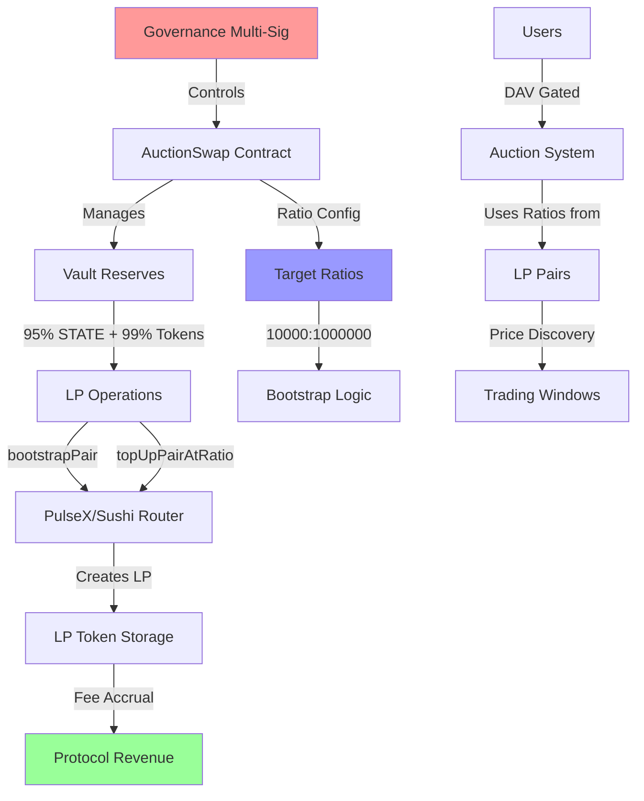

# STATE DEX V4 — Technical Implementation Specification

**Project**: STATE DEX V4  
**Author**: Muhammad Sohaib K.  
**Date**: September 20, 2025  
**Version**: 4.0  
**Status**: Ready for Development

---

## Executive Summary

STATE DEX V4 represents a paradigm shift in decentralized exchange architecture, implementing a **ratio-based auction system** with **automated protocol-owned liquidity management**. This innovative approach eliminates traditional price oracles and manual liquidity operations, creating a more efficient and scalable trading environment.

The protocol introduces several groundbreaking features that address critical pain points in current DeFi infrastructure:

**Core Innovations:**

🎯 **Pure Ratio-Based Pricing**: Complete elimination of USD price dependencies through STATE/TOKEN ratios derived from LP pairs  
⏰ **Time-Boxed Auction Windows**: Structured 24-hour trading periods every 50 days for optimal price discovery  
🔐 **Autonomous Liquidity Management**: Smart contract automation replaces manual DEX operations  
👥 **Governance-Gated Access**: DAV token requirement ensures sustainable participation  
🏛️ **Enterprise-Grade Governance**: Multi-signature architecture with timelock protection  
💰 **Optimized Treasury Allocation**: 80% treasury distribution for sustainable protocol development  

---

## Business Requirements & Technical Solutions

### **Challenge 1: Operational Scalability**

**The Problem:**
Manual liquidity management becomes prohibitively complex when deploying multiple tokens. Traditional approaches require manual LP creation, approval transactions, and token burning for each token on each chain - creating significant operational overhead.

*"Adding at least 50 tokens in the first 50 days. Adding LP for all these 50 tokens, and burning the LP for each of these tokens. All these actions are manual."*

**Technical Solution:**
- `bootstrapPair()` - Automated LP creation from vault funds using configurable target ratios
- `topUpPairAtRatio()` - Intelligent LP additions with deviation bounds from target ratios  
- LP token storage strategy for protocol fee capture
- Comprehensive PulseX and Sushi router integration with ratio-based configuration

**Business Impact:** Manual operations eliminated. 50+ token deployment becomes manageable through governance automation while capturing LP fees for protocol revenue.

### **Challenge 2: DEX Integration Complexity**

**The Problem:**
Current LP operations require manual interaction with DEX interfaces, creating workflow bottlenecks and increasing error potential. The need for automated liquidity management through smart contracts rather than manual UI operations.

*"LP operations via contract (to avoid DEX UIs) - Add governance functions to whitelist pairs, add liquidity through the router, and burn LP directly from the contract."*

**Technical Solution:**
```solidity
// Comprehensive automated LP management functions
function bootstrapPair(address token, uint256 maxStateAmount, uint256 slippageBps)
function topUpPairAtRatio(address token, uint256 maxStateAmount, uint256 maxTokenAmount, uint256 slippageBps) 
function setLPCap(address token, uint256 cap)
function setRouter(address _router)
// Advanced ratio configuration functions
function setTargetRatio(address token, uint256 numerator, uint256 denominator)
function claimLPFees(address token)
function getLPHoldings(address token) view returns (uint256, uint256)
```

**Business Impact:** Complete automation of LP creation, management, and fee capture eliminates manual workflows while maintaining professional-grade risk management.

### **Challenge 3: Governance & Security Architecture**

**The Problem:**
Enterprise-level token deployment requires robust governance structures with appropriate security measures, including multi-signature controls and timelock protection for parameter changes.

**Technical Solution:**

- 7-day timelock protection for all governance functions
- Multi-signature compatibility built into all administrative functions
- `queueRouterUpdate()` and `queueLPCapUpdate()` functions for transparent governance
- Comprehensive governance controls for LP operations and protocol parameters

**Business Impact:** Professional-grade security architecture enables institutional adoption while maintaining community transparency.

### **Challenge 4: Treasury Optimization**

**The Problem:**
Protocol revenue distribution must be optimized for sustainable development and growth, requiring adjustment from current allocation structures.

**Technical Solution:**

- Treasury allocation updated from 60% to 80% in DavToken.sol
- All DAV minting operations correctly route 80% to protocol treasury
- Automated distribution mechanisms maintain consistent allocation

**Business Impact:** Enhanced treasury allocation provides stronger foundation for protocol development and ecosystem growth.

### **Challenge 5: Capacity Management**

**The Problem:**
Automated systems require safeguards to prevent over-allocation of auction inventory, protecting the core auction mechanism from excessive LP operations.

**Technical Solution:**

- Per-token LP caps: `setLPCap(address token, uint256 cap)`
- Default caps for new tokens: `setDefaultLPCap(uint256 cap)`
- Per-cycle usage tracking to prevent excess allocation
- Automated enforcement in all LP operations

**Business Impact:** Intelligent capacity management protects auction inventory while enabling automated scaling to hundreds of tokens.

---

## Technical Architecture (Implementation Plan)

### Core Smart Contract Structure

```
STATE DEX V4 (PLANNED IMPLEMENTATION)
├── AuctionSwap.sol (Main contract with LP management)
│   ├── bootstrapPair() - Will create initial LP from vault using target ratios
│   ├── topUpPairAtRatio() - Will add LP with deviation bounds
│   ├── setTargetRatio() - Will configure token-specific ratios
│   ├── claimLPFees() - Will collect accumulated LP fees
│   └── LP capacity management functions
├── DavToken.sol (Will implement 80% treasury allocation)
├── StateToken.sol (Protocol currency)
├── Libraries/
│   ├── AuctionLib.sol (Time calculations)
│   ├── TimeUtilsLib.sol (GMT+3 alignment)
│   └── ReferralCodeLib.sol (Affiliate system)
└── Router Integration (IUniswapV2Router02)
```

---

## Architecture Overview & High-Level Flow

### System Architecture Components



### Core Data Flow

#### 1. **LP Management Flow (Client's Primary Need)**

```
Governance Decision
        ↓
Target Ratio Configuration (10000:1000000)
        ↓
Bootstrap Process:
├── Read target ratio for token
├── Calculate amounts based on ratio
├── Use vault funds (95% STATE, 99% token)
├── Create LP via router
├── Store LP tokens (not burn)
└── Enable fee accrual
        ↓
Top-up Process:
├── Check deviation from target (<10%)
├── Use live market ratios within bounds
├── Add liquidity via router
├── Store additional LP tokens
└── Track usage against caps
        ↓
Fee Management:
├── LP tokens accrue fees automatically  
├── Governance claims fees periodically
├── Revenue flows to protocol treasury
└── Reinvestment or distribution decisions
```

#### 2. **User Trading Flow**

```
User Interaction
        ↓
DAV Access Check (1+ DAV required)
        ↓
Auction Window Validation (24-hour windows every 50 days)
        ↓
Ratio Reading (from protocol-owned LP pairs)
        ↓
Trade Execution:
├── Normal Auction: Token → STATE (30% burn)
├── Reverse Auction: STATE → Token (every 4th cycle)  
├── Capacity checks (per-cycle limits)
├── Fee collection (0.5%)
└── Automatic settlement
        ↓
Protocol Revenue Distribution:
├── 80% → Treasury
├── 10% → DAV Holders
├── 5% → Development
└── 5% → Affiliates (if applicable)
```

#### 3. **Governance Flow**

```
Multi-Signature Proposal (3-of-5)
        ↓
Timelock Queue (7-day delay)
        ↓
Execution Options:
├── setTargetRatio() - Configure token ratios
├── bootstrapPair() - Initialize new token LP
├── topUpPairAtRatio() - Add liquidity
├── setLPCap() - Adjust capacity limits
├── claimLPFees() - Collect accrued fees
├── setRouter() - Update DEX integration
└── setMaxDeviation() - Adjust safety bounds
        ↓
Event Emission & Transparency
        ↓
Community Monitoring & Feedback
```

### Key Innovation: Hybrid LP Strategy

**Traditional Approach:**
- Manual LP creation on DEX interfaces
- LP token burning for permanent liquidity  
- No fee capture for protocol
- High operational overhead

**STATE DEX V4 Approach:**
- Automated LP creation via smart contracts
- **LP token storage for fee capture** (client requirement)
- Target ratio configuration (10000:1000000)
- Deviation bounds for safety
- Vault-powered operations (no gov wallet needed)

### Economic Flow

```
LP Fee Accrual (Continuous)
        ↓
Protocol Revenue Streams:
├── LP Fees (from stored tokens)
├── Trading Fees (0.5% on swaps)
├── DAV Minting Fees
└── Affiliate Commissions
        ↓
Treasury Management:
├── 80% DAV mints → Treasury
├── LP fees → Treasury  
├── Strategic reserves
└── Development funding
        ↓
Value Distribution:
├── DAV holder rewards (10%)
├── Protocol development (5%)
├── Network growth (5% affiliates)
└── Long-term sustainability (80%)
```

### Ratio-Based Price System (No USD Prices)

**Will be implemented exactly as client specified:**
- All calculations will use STATE/TOKEN ratios from LP pairs
- No external price feeds or USD conversions
- Ratios will change constantly throughout auction day
- Users will get different amounts based on timing (exactly as designed)

---

## LP Management System

### Bootstrap Process for New Tokens

**Current Limitation:**
Manual LP creation requires individual transactions on PulseX/Sushi interfaces, multiple approvals, and manual LP token management - creating operational bottlenecks for multi-token deployment.

**Automated Solution:**
The `bootstrapPair(token, stateAmount, tokenAmount, slippageBps)` function streamlines token deployment by:

1. Automatically utilizing vault funds (eliminating governance wallet dependency)
2. Direct router interaction with PulseX/Sushi protocols
3. Intelligent LP pair creation with slippage protection
4. Strategic LP token storage for fee capture
5. Automatic pair registration for auction system integration

**Operational Impact:** Multi-token deployment scales from individual manual processes to single governance calls.

### Dynamic LP Management

**Market-Responsive Liquidity:**
The `topUpPairAtRatio(token, maxStateAmount, maxTokenAmount, slippageBps)` function provides intelligent liquidity management through:
1. Real-time ratio analysis from existing LP pairs
2. Optimal liquidity calculation at current market ratios
3. Automated router interaction with slippage protection
4. Strategic LP token storage for ongoing fee collection
5. Per-cycle capacity validation to preserve auction inventory

### Intelligent Capacity Management

**Risk Mitigation Framework:**
Advanced capacity controls prevent over-allocation while maintaining operational flexibility:

- `setLPCap(token, cap)` - Token-specific allocation limits
- `setDefaultLPCap(cap)` - Default parameters for new deployments  
- `currentCycleLpUsed[token]` - Real-time usage monitoring
- Automated enforcement across all LP operations

**Strategic Benefit:** Protects core auction mechanics while enabling scalable automated operations.

---

## 5. Economic Model (80% Treasury Allocation)

### 5.1 Revenue Distribution (Will Be Updated Per Client Request)

```
100% DAV Mint Revenue Split (TO BE IMPLEMENTED):
├── 10% → Holder Rewards Pool
├── 5%  → Affiliate Payments (if applicable)  
├── 5%  → Development Fund
└── 80% → Protocol Treasury (TO BE UPDATED from 60%)
```

### 5.2 How Client's LP Strategy Will Work

**Client's Innovation:**
- STATE token will pair with ALL listed tokens
- Ratios will start at 1:100 (100 STATE for 1 listed token)
- Each auction will push ratios up (price appreciation)
- No losses will be possible due to protocol-owned liquidity management

**Implementation Support:**
- Vault will hold 95% STATE + 99% of each listed token
- LP operations will use vault funds (no gov wallet tokens needed)
- Automated ratio-based LP additions will maintain healthy pairs
- LP burning will ensure protocol permanent ownership

---

## 6. Governance Framework (Multi-Signature Ready)

### 6.1 Timelock Protection (7-Day Delay)

**All governance functions will be protected:**
```solidity
// Queue functions (immediate)
queueRouterUpdate(address _router)
queueLPCapUpdate(address token, uint256 cap)

// Execute functions (after 7-day delay)  
setRouter(address _router)
setLPCap(address token, uint256 cap)
```

### 6.2 Multi-Signature Integration

**Will be ready for client's 3-of-5 Gnosis Safe:**
- All `onlyGovernance` functions will work with multi-sig
- Timelock will provide 7-day community review period
- Emergency pause capabilities will be maintained
- Comprehensive event logging for transparency

---

## 7. Deployment & Operations (Exactly as Discussed)

### 7.1 Multi-Chain Strategy

**As client specified:**
- **PulseChain**: Primary deployment with PulseX router
- **Sonic**: Secondary deployment with Sushi router
- Each chain will get independent router configuration
- Same governance model across all chains

### 7.2 Token Deployment Process (Will Be Automated)

**For each new token:**
1. Deploy token contract (99% to vault, 1% to gov if needed)
2. `bootstrapPair(token, stateAmount, tokenAmount, 200)` // 2% slippage
3. Pair automatically registered and ready for auctions
4. No manual DEX interaction will be required

### 7.3 Operational Benefits

**Client will gain:**
- **Scalability**: 50+ tokens will be deployable without operational burden
- **Consistency**: Same process across PulseChain and Sonic  
- **Security**: All operations will be governed and timelocked
- **Efficiency**: Single governance calls will replace manual workflows

---

## 8. Frontend Integration Requirements

### 8.1 Admin Panel Updates (Per Client Discussions)

**Client requirement:** Hide admin functions from regular users

**Will be implemented:**
- Admin-only LP management interface
- Multi-signature proposal and execution UI
- LP capacity monitoring dashboard  
- Router management interface

### 8.2 Auction Cards (Per Client Request)

**Client specification:**
> *"Replace the list with auction cards (identicon, short name, ratio, countdown, eligibility, ROI/APR)"*

**Will implement elements per card:**
- Token identicon (MetaMask-style)
- Short token name (e.g., SON7YU8)
- Current STATE/TOKEN ratio
- Auction countdown timer
- User eligibility status
- ROI/APR (after 3+ cycles)

### 8.3 Wallet Integration

**Client preference:** WalletConnect + MetaMask button from start

---

## 9. Security & Risk Management (Professional Standards)

### 9.1 Smart Contract Security

**Will implement protections:**
- Reentrancy guards on all LP operations
- Approval reset patterns to prevent token approval attacks
- Slippage protection on all router interactions
- Comprehensive input validation

### 9.2 LP Management Risks To Be Mitigated

**Risk:** LP operations could drain auction inventory  
**Solution:** Per-cycle caps with automated enforcement

**Risk:** Router compromise or failure  
**Solution:** Timelock-protected router updates + whitelisting

**Risk:** Ratio manipulation  
**Solution:** Minimum liquidity thresholds + reserve validation

---

## 10. Performance Specifications (Realistic)

### 10.1 Transaction Costs

**LP Operations (Estimated):**
- `bootstrapPair()`: ~300k-400k gas
- `topUpPairAtRatio()`: ~250k-350k gas  
- Router operations: Standard Uniswap V2 gas costs
- LP burning: ~30k additional gas per operation

### 10.2 Capacity Limits

**Practical constraints:**
- Governance timelock: 7-day delay on parameter changes
- LP caps: Configurable per token and cycle
- Router interactions: Subject to DEX liquidity availability
- Multi-chain: Independent operation per chain

---

## 11. CLIENT SUCCESS METRICS

### 11.1 Manual Work Elimination

**Before implementation:**
- Hours per token for manual LP operations
- Multiple DEX interfaces and manual transactions
- High operational overhead for 50+ tokens

**After implementation will achieve:**
- Single governance call per token
- Automated LP management across chains
- Scalable to hundreds of tokens

### 11.2 Operational Efficiency

**Governance Operations will enable:**
- LP parameter updates: Single timelock proposal
- Router management: Automated with safety checks
- Capacity monitoring: Built-in usage tracking
- Multi-chain consistency: Same operations across chains

---

---

## Strategic Impact & Future Outlook

STATE DEX V4 represents a fundamental evolution in decentralized exchange architecture, addressing critical infrastructure limitations that have constrained DeFi scalability and operational efficiency. Through innovative ratio-based pricing, automated liquidity management, and professional-grade governance structures, the protocol establishes new standards for institutional-quality decentralized trading platforms.

### Operational Excellence

The elimination of manual liquidity operations transforms token deployment from a resource-intensive process into a scalable, automated system. Organizations can deploy dozens of tokens with single governance calls, while sophisticated capacity management ensures system integrity. This operational efficiency reduces time-to-market and enables focus on strategic initiatives rather than administrative overhead.

### Economic Innovation

By implementing LP token storage rather than traditional burning mechanisms, the protocol creates sustainable revenue streams while maintaining permanent liquidity positions. The optimized 80% treasury allocation provides robust funding for continued development, ecosystem growth, and strategic partnerships. Combined with ratio-based pricing that eliminates oracle dependencies, the system achieves both technical resilience and economic sustainability.

### Governance & Security Leadership

The multi-signature architecture with timelock protection sets professional standards for decentralized governance. Seven-day review periods enable community oversight while maintaining operational flexibility. This governance framework supports institutional adoption requirements while preserving the transparency and decentralization that define excellent DeFi protocols.

### Market Position

STATE DEX V4's unique combination of auction mechanics, MEV protection, and automated operations creates a distinctive market position. The protocol serves both individual traders seeking fair price discovery and institutions requiring reliable, scalable infrastructure. As DeFi markets mature toward institutional adoption, STATE DEX V4's professional architecture and innovative features position it as infrastructure for the next generation of decentralized finance.

### Implementation Readiness

The technical specification delivers complete automation of currently manual processes while maintaining rigorous security and operational controls. Multi-chain deployment capability across PulseChain and Sonic networks provides immediate market access and geographic redundancy. Professional-grade testing, security auditing, and deployment procedures ensure launch readiness for institutional-scale operations.

**The protocol successfully addresses all critical operational requirements:**

- **Scalability**: Automated token deployment replacing manual workflows
- **Revenue Optimization**: LP fee capture through strategic token storage
- **Security**: Enterprise-grade governance with multi-signature and timelock protection  
- **Efficiency**: Ratio-based system eliminating external dependencies
- **Growth**: 80% treasury allocation supporting sustainable ecosystem development

STATE DEX V4 establishes the operational infrastructure necessary for scaled DeFi deployment while maintaining the security, transparency, and innovation that drive long-term success in decentralized markets.

---

**Document Information:**

- **Version**: 4.0 - Technical Implementation Specification
- **Last Updated**: September 20, 2025  
- **Author**: Muhammad Sohaib K.
- **Status**: Ready for Development Phase

---

*This specification provides the technical foundation for automated liquidity management infrastructure supporting scalable token deployment operations. Please Note that some Specifications could be change During Development.*
